<p align="center">
  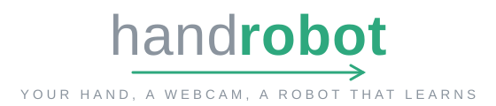
</p>

<p align="center">
  
  
  
  
  
  
</p>

Teach a simulated robot arm to pick things up by waving your hand at your webcam.
No robot, no gloves - one laptop camera, your bare hand, and an arm that learns
the task from your demonstrations and then does it alone.

<p align="center">
  <b>95/100</b> multi-task unseen episodes &nbsp;·&nbsp;
  <b>30 Hz</b> hand-to-joints &nbsp;·&nbsp;
  <b>15.0 mm</b> neural fingertips vs a ≈14 mm physical ceiling &nbsp;·&nbsp;
  <b>520</b> tests &nbsp;·&nbsp; <b>$0</b> hardware
</p>

Two arms: the [Franka Panda](https://frankarobotics.com) (default - seven
joints, a workspace thirty times larger) and the
[SO-101](https://github.com/TheRobotStudio/SO-ARM100) (`--robot so101` - the
one you can buy for ~£200).

<p align="center">
  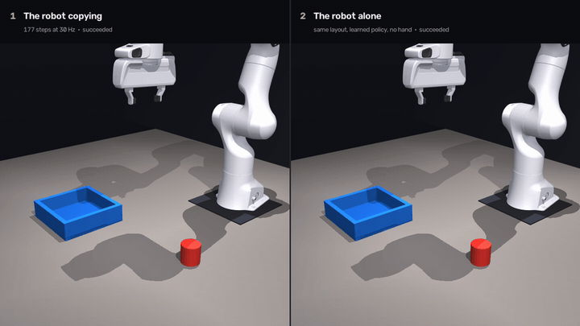
  <br/>
  <em>Left: the arm copying a human hand, live through a webcam. Right: the trained policy on the same layout - no hand anywhere.</em>
</p>

---

## Why this matters

Demonstration data is the bottleneck of modern robot learning - rigs built to
collect it cost thousands. This system collects it with hardware you already
own, in the same research direction as NVIDIA's
[AnyTeleop](https://arxiv.org/abs/2307.04577) and
[Open Teach](https://arxiv.org/abs/2403.07870):

| | |
|---|---|
| 🎓 **Zero-cost demo collection** | anyone with a laptop can produce imitation-learning datasets - no gloves, no VR, no robot |
| 🧪 **Task prototyping before hardware** | prove a manipulation task is learnable in simulation before buying an arm |
| 🦾 **Sim-to-real ready** | action/observation spaces match the physical SO-101's serial protocol by construction |
| 🖐 **Dexterous track** | the differentiable-FK retargeter extends the same idea to a 16-DoF hand |

## What it actually does

1. **Tracks** your hand from one webcam into a metric 3D pose.
2. **Retargets** it onto the arm's five real degrees of freedom at 30 Hz.
3. **Records** every demonstration - images, joints, commands, task.
4. **Trains** an Action Chunking Transformer on them.
5. **Runs alone** on unseen layouts, scored by the same physics that scored you.

<p align="center">
  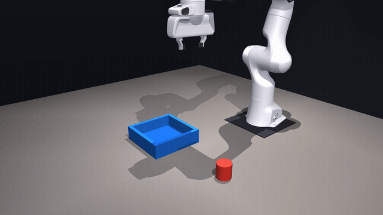
  <br/>
  <em>The learned policy, alone, on layouts it has never seen.</em>
</p>

## Sizing the task to the operator, not the other way round

<details>
<summary><b>The single most important design decision - and the study behind it</b> (click)</summary>

The single most important decision here is how big the object is, and the first
version got it badly wrong.

A [published study of vision-based teleoperation with 42
participants](https://arxiv.org/abs/2508.14994) reports 88% success at a
placement error of **6.7 cm**. That is roughly what a person can do through a
webcam. The first version of this asked for **8 mm** -- the accuracy a 25 mm
cube demands -- and was therefore impossible however well the software worked.
No amount of filtering closes an order of magnitude.

So the object is a 60 mm puck and the bin is 21 cm across, which tolerates a
7 cm miss. It is round rather than square for a second reason: a 60 mm cube
turned 34 degrees presents 83 mm across the jaws, wider than the gripper opens
at all, so some layouts would have been ungraspable unless the operator also
matched the wrist angle. A cylinder is 60 mm from every direction.

Measured end to end, driving the real tracker, retargeter, solver and physics
with a synthetic hand at varying levels of landmark noise:

</details>

<p align="center">
  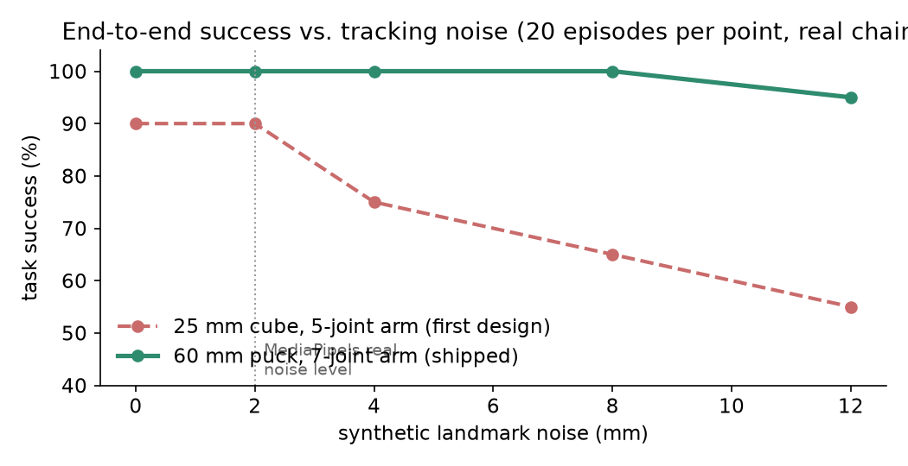
</p>

## Measured results

A baseline policy trained only on scripted demonstrations, so that every number
below is reproducible without a camera:

| | Panda (default) | SO-101 |
|---|---|---|
| Scripted expert | **100%** over 80 episodes | **100%** over 80 |
| Learned policy (ACT), single task | **95%** - 38/40 unseen layouts | 95% - 19/20 |
| Multi-task policy, its bin task | **100%** - 25/25 unseen | - |
| Training data | 150 scripted episodes | 150 |
| Training | 12,000 steps, ~45 min on an M-series Mac | 6,000 steps, ~25 min |
| Grasp accuracy | 6.8 mm mean planar error | 6.1 mm |

Reproduce it with `./scripts/quickstart.sh`. The raw evaluation is in
`runs/results/panda_eval.json`, and `runs/results/panda_demo.mp4` is the policy solving
four unseen layouts.

The grasp error is the number that decides everything: the cube is 25 mm wide,
so the gripper has to arrive within roughly 8 mm or the jaws close on air. It
fell from 33.5 mm at 2,000 training steps to 6.1 mm at 6,000, which is the
moment the success rate went from 0% to 90%.

**This baseline is not the point of the project.** It exists so the training
pipeline is known-good before you record anything, and so your own
hand-trained policy has something to be compared against on identical layouts.

## Four tasks, one policy, plain-language selection

The same scene serves four objectives - and a single conditioned ACT policy
learns all of them, selected by name or by any natural phrasing:

```bash
.venv/bin/python -m handrobot eval  --task "push it to the ring"
.venv/bin/python -m handrobot demo  --task lift
.venv/bin/python -m handrobot collect-scripted --task touch
```

| task | objective | judged by the physics as |
|---|---|---|
| `bin` | put the puck in the bin | puck inside the bin, resting |
| `push` | push the puck to the green ring | puck within 5 cm of the ring, on the table |
| `lift` | lift the puck up high | puck held above 15 cm |
| `touch` | touch the puck without moving it | gripper on the puck, puck undisplaced |

The scripted expert plans each one differently (pushing is a closed-jaw blade
with closed-loop replanning when the puck veers), and the policy receives the
task as a learned embedding. Conditioning is honest one-hot with language
aliases, not an LLM - the README says exactly what the code does.

**Measured** - one conditioned ACT policy, 14k steps on 480 scripted episodes:

<p align="center">
  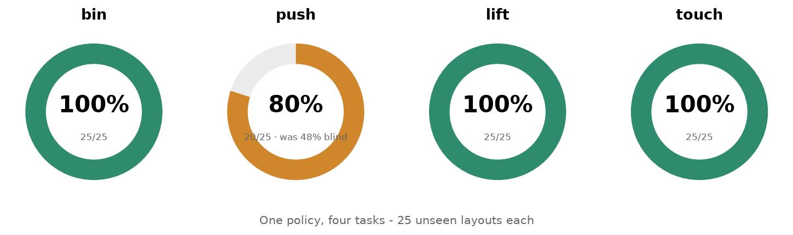
</p>

Push is the honest hard one - contact-rich, long-horizon, and the target is a
ring on the table rather than a wall-sized bin. Its first score was 48%,
because the ring was sampled outside the policy camera's frame and was
near-invisible at 128 px anyway; making the target visible (and unpushable
zones impossible) took it to 80%. That diagnosis-to-number chain is the
project in miniature.

## Diffusion policy, for the ablation

The second policy class, sharing ACT's observation encoder token for token, so
the comparison isolates exactly one variable - how the action chunk is
generated (CVAE decode vs. iterative denoising):

```bash
.venv/bin/python -m handrobot train --data runs/demos/panda_scripted --model diffusion
```

DDPM training with a cosine schedule, DDIM sampling, x0 clamping; both models
are scored by the same simulator on the same seeds.

## Stereo depth, if you have a second webcam

Monocular depth is the pipeline's one weak signal. A second webcam and a ruler
turn it into geometry:

```bash
.venv/bin/python -m handrobot teleop --stereo-device 1 --baseline 0.12
```

Depth becomes ``focal_length x baseline / disparity``; bearing stays with the
primary camera; disagreement falls back to monocular. One pixel of noise at
half a metre: under 1 cm of depth error, versus the centimetres a size-based
estimate wanders.

## Export to LeRobot

Datasets convert to the Hugging Face LeRobot format through LeRobot's own
writer (valid by construction), ready for `push_to_hub()`:

```bash
uv pip install 'lerobot[dataset]'
.venv/bin/python -m handrobot export-lerobot \
    --data runs/demos/panda_multitask --out runs/lerobot \
    --repo-id yourname/handrobot-panda
```

Task instructions travel with every frame, so language-conditioned trainers
see them.

## The dexterous hand: neural retargeting

A second, self-contained showpiece: a 16-joint [LEAP
Hand](https://leaphand.com) mirrors your fingers live, driven by a neural
retargeter rather than any hand-tuned mapping.

```bash
.venv/bin/python -m handrobot dexhand            # live mirror
.venv/bin/python -m handrobot dexhand --record   # 1 minute of guided capture,
                                                 # then it trains on YOUR hand
```

The retargeting network is trained *through* a differentiable torch
re-implementation of the LEAP hand's forward kinematics (exact to nanometres
against MuJoCo), so it needs no labelled joint angles at all: the loss is the
distance between where your fingertips are and where the robot's end up.
`--record` fine-tunes it on your own hand and installs the result only if it
beats the base network on a held-out slice of your own poses -- measured on a
real 1,490-pose recording, fingertip error falls from 20.1 mm to 15.0 mm
against a physical ceiling of about 14 mm (the LEAP hand's fingers are not
human-proportioned; that ceiling is what any method could reach).

MediaPipe's handedness label canonicalises the geometry, which makes the
mirroring immune to camera mirroring on both axes -- pinned by tests either
way, over ten random poses each.

<p align="center">
  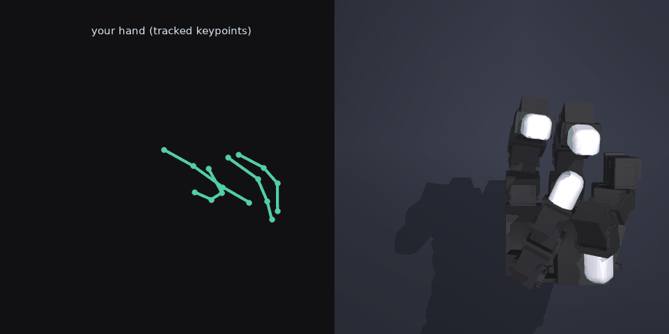
  <br/>
  <em>A real recorded hand (left, the tracked keypoints) replayed through the personal retargeter onto the LEAP hand (right).</em>
</p>

<p align="center">
  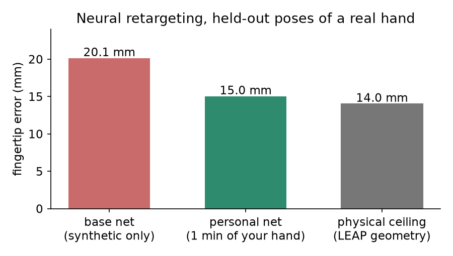
</p>

How a network trains with no labels at all - the loss goes *through* the robot:

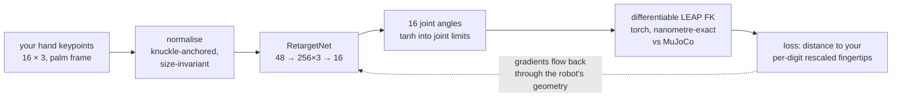

## Install

> In a hurry? **[QUICKSTART.md](QUICKSTART.md)** is the whole flow in five
> commands, and `make` prints every launcher.

```bash
uv venv --python 3.12 .venv
uv pip install -e ".[dev]"
./scripts/fetch_models.sh          # MediaPipe hand landmarker weights, ~8 MB
.venv/bin/python -m handrobot info # should print all-ok
```

Python 3.12 specifically: MediaPipe has no wheels for 3.13 or newer.

On macOS the first webcam command triggers a permission prompt. If it does not
appear, enable your terminal under **System Settings → Privacy & Security →
Camera**.

## Quick start, in order

### 1. Check your camera can see your hand

```bash
.venv/bin/python -m handrobot handcheck
```

Move your hand around; open and close your pinch. Press `q` to finish. It reports
what fraction of frames were tracked, the estimated distance to your hand, and
whether the depth axis needs flipping. If it says *"depth axis is inverted"*, add
`--flip-z` to the `teleop` command below.

Aim for 90%+ tracking. More light on your hand and a plainer background both help.

### 2. Prove the task is solvable, without touching the camera

```bash
.venv/bin/python -m handrobot eval --episodes 25       # scripted expert
.venv/bin/python -m handrobot demo  --episodes 4 --out runs/results/scripted.mp4
```

The scripted expert exists so that the physics, the grasp and the scoring are
known-good *before* you spend ten minutes recording demonstrations. It should
report 100%.

### 3. Record your own demonstrations

```bash
.venv/bin/python -m handrobot teleop --out runs/demos/human
```

**One window opens** - the whole cockpit, captured live (the hand here is the
test-suite photograph, driven through the real tracker):

<p align="center">
  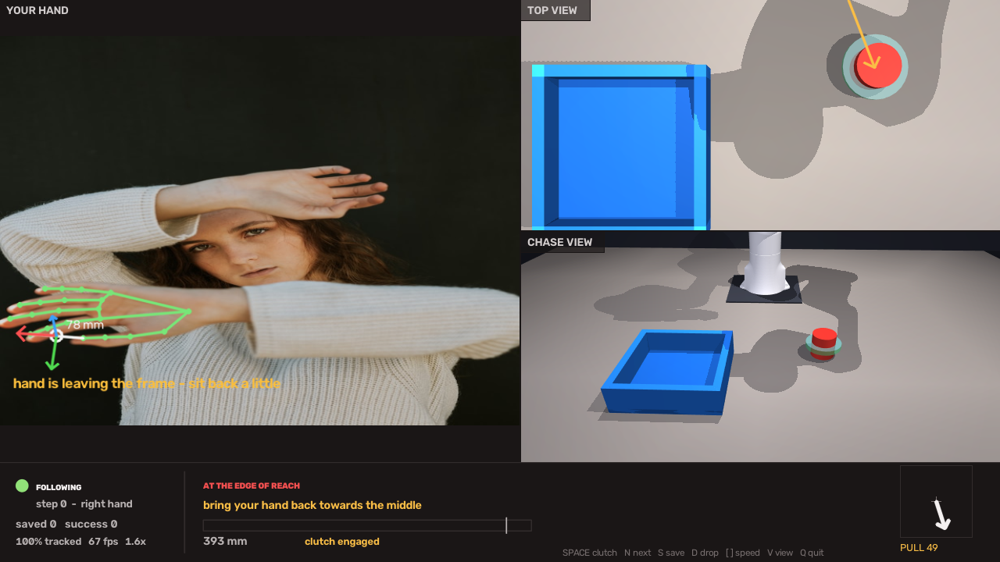
</p>

<details><summary><b>Why one window, why these views</b> (click)</summary>

A top view cannot show height, a side view cannot show depth; you need both.
The strip along the bottom tells you, in millimetres, exactly how to move.
One window because macOS makes MuJoCo's viewer and OpenCV's mutually
exclusive; `v` cycles the lower panel.

</details>

| Key     | What it does |
|---------|--------------|
| `space` | toggle the clutch - the arm only follows your hand while engaged |
| `n`     | new episode (resets the scene, starts recording) |
| `s`     | save the current episode |
| `d`     | discard it and reset |
| `h`     | send the arm home |
| `[` `]` | make the arm less / more sensitive to your hand |
| `v`     | put the next view on the stage (follow / front / wide / wrist) |
| `w`     | put the wrist view on the stage |
| `t`     | hide the tiles - the stage takes the whole window |
| `?`     | show the key list on screen |
| `q`     | quit |

<details><summary><b>The three things drawn on your own camera</b> (click)</summary>

Teleoperation through a webcam fails in three ways that look identical from the
operator's side - the arm simply stops responding. The hand has moved somewhere
the arm cannot follow; the hand has drifted to the edge of the frame, where the
detector degrades; or the hand is too close to or too far from the camera for
the depth fit. None of them are visible in a camera image, so they are drawn
into it.

- **The reach envelope** - the green outline - is not an illustration. The
  mapping from hand to robot is affine while the clutch holds, so inverting it
  turns the arm's reachable region into a set of *hand* positions, projected
  through the same pinhole model that produced the hand pose. Inside the outline
  the arm follows, outside it the arm stops, and
  `tests/test_roi.py::test_inside_the_outline_means_the_arm_will_follow` sweeps a
  grid of hand positions checking exactly that agreement. It moves when you
  re-clutch and shrinks when you raise the sensitivity, because the region it
  describes does.
- **The depth gauge** on the right places your hand in the band where monocular
  depth is worth trusting: the fit's error grows with the square of the
  distance, while a hand held very close leaves the frame the moment it moves.
- **The margin rectangle** marks where the detector starts to degrade, before
  it does rather than after.

</details>

The interface is one large stage with a column of tiles beside it, the way
anything that watches several cameras at once is laid out: attention is not
divisible, so the layout does not divide it either. Any view can be swapped onto
the stage, and the status ribbon lies *over* the stage rather than taking a band
of its own. Overlays are clipped to the picture and shown only while they say
something - the reach outline while the clutch is engaged, the frame border only
once the hand is at it, the tracking hairline only for frames that were lost.

The interface is drawn in logical units and composed at whatever size is asked
for - `--ui 1080p`, `1440p`, `4k`, `8k`, or a height in pixels - so text and
overlays are *drawn* larger rather than upscaled. Simulator panels are clamped
to the model's offscreen buffer and the panel redraw rate is measured and
adapted: rendering is the only cost in a control period that can be spent
selectively, and a panel held for one extra frame is invisible where a control
period that overran is not.

Start at the default sensitivity and adjust with `[` and `]` in the first thirty
seconds. Too twitchy means lower it; having to reach across the room means raise
it. The change never jerks the arm - it takes effect from your next movement.

**Read the middle of the strip.** It names the direction and the distance:

```
LEFT 35   DOWN 8   PUSH 22
millimetres, to reach the cube
```

When it says `LINED UP WITH THE CUBE`, lower and pinch. If it warns
`AT THE EDGE OF REACH`, your hand is asking for somewhere the arm cannot go -
move back towards the middle and it picks up again immediately.

<details>
<summary><b>Two habits that make the difference</b> (click)</summary>


1. **Pause a beat before you descend, and again before you close.** Smoothing
   costs a little lag while your hand is moving, and it disappears the instant
   you stop. The readout shows how far the gripper is from the cube; wait for it
   to go green (under 12 mm) before you lower.
2. **Use the clutch constantly.** Release it whenever your hand drifts somewhere
   awkward, move your arm back to comfortable, press it again. The arm does not
   move while it is off.

The clutch is the important one. Release it to move your hand back to a
comfortable position without dragging the robot along, then engage again - same
as lifting a mouse off the desk. An episode that reaches the bin is saved
automatically.

</details>

**Aim for 40–60 successful episodes.** It takes about ten minutes.

### 4. Train

```bash
.venv/bin/python -m handrobot train --data runs/demos/human --out runs/checkpoints/mine
```

About 25 minutes for 15k steps on an M-series Mac. Training prints an L1 action
error; the number that matters is the success rate in the next step.

Short of demonstrations? Mix in scripted ones:

```bash
.venv/bin/python -m handrobot collect-scripted --episodes 150 --out runs/demos/human
```

They are written into the same dataset and tagged `scripted`, so
`handrobot dataset --data runs/demos/human` always shows you what the mix is.

### 5. Score it honestly

```bash
.venv/bin/python -m handrobot eval --checkpoint runs/checkpoints/mine/best.pt --episodes 50
```

Fresh seeds, so every layout is one the policy has never seen. Success is judged
by the simulator: the cube has to be inside the bin and stay there.

### 5b. If the score is low, find out why

```bash
.venv/bin/python -m handrobot diagnose --checkpoint runs/checkpoints/mine/best.pt
```

A success rate tells you a policy is bad, not what is wrong with it.
This separates the three causes - grasp misses (train longer / more demos),
camera-blind memorisation (more varied layouts, not more steps), and diverged
training (lower the learning rate) - which need opposite fixes.

### 6. Build the film

```bash
.venv/bin/python -m handrobot film \
    --data runs/demos/human --episode 0 \
    --checkpoint runs/checkpoints/mine/best.pt \
    --out runs/results/film.mp4
```

Three panels, side by side, same episode:

- **left** - your webcam with the hand overlay, so it is visible that the only
  input is a bare hand;
- **middle** - the robot copying you at the time, re-rendered at full
  resolution (the simulator is deterministic, so the recorded actions replay
  exactly);
- **right** - the trained policy attempting the *same layout* with no hand
  anywhere.

Drop `--checkpoint` for the first two panels only, which is what you have before
training finishes.

## Commands

| Command | What it does |
|---|---|
| `info` | versions, devices, and whether the assets are present |
| `handcheck` | webcam diagnostic: tracking rate, depth, axis orientation |
| `teleop` | drive the arm with your hand and record demonstrations |
| `collect-scripted` | generate demonstrations with the scripted expert |
| `dataset` | summarise a dataset |
| `replay` | render the camera streams of a recorded episode |
| `train` | train ACT |
| `eval` | success rate over fresh layouts |
| `diagnose` | why a policy is failing: grasp accuracy, camera use, motion |
| `demo` | montage video of a controller solving the task |
| `film` | the three-panel film |
| `dexhand` | LEAP hand mirrors your fingers via the neural retargeter |

## How it works

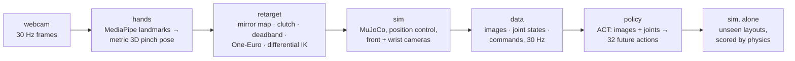

**`handrobot.hands`** - MediaPipe gives two landmark sets: normalised image
coordinates with no scale, and metric world coordinates with no translation.
Measuring one rigid segment of the hand in both, and applying the pinhole
relation, recovers absolute depth. The hand frame comes from the anatomy: wrist
to pinch point is the approach axis, thumb tip to index tip is the jaw axis.

**`handrobot.retarget`** - the arm has five joints before the gripper, so it has
five controllable degrees of freedom, not six. The missing one shows up as a
coupling between height and approach angle: near the table the gripper can point
straight down, higher up it must lean outward. `reach.py` measures that coupling
on a grid and caches it, so nothing ever commands a pose the arm cannot hold.
The mapping is therefore position (relative, clutch-anchored), jaw rotation
(also relative and clutch-anchored, so re-engaging with a turned wrist never
snaps the arm), and jaw opening (absolute) - exactly five. A 3 mm deadband --
the commanded position rides behind the hand on a short rope -- makes a still
hand command a perfectly still arm: landmark noise moves at the same *speed* as
a deliberate slow drag, so no velocity test can separate them, but their
displacements separate cleanly.

<p align="center">
  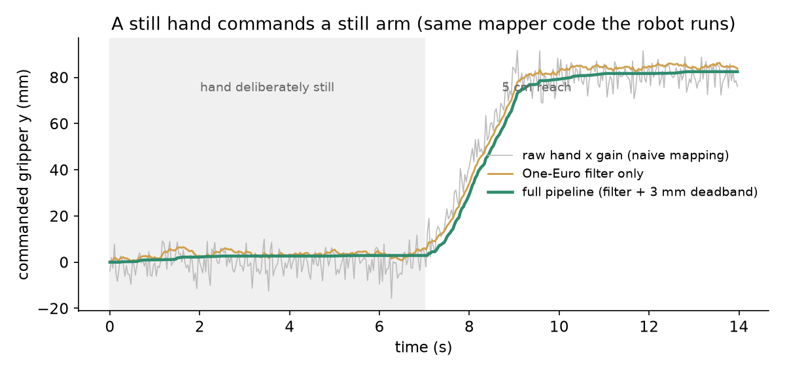
</p>

The clutch and every mapping decision, as the 30 Hz loop actually runs:

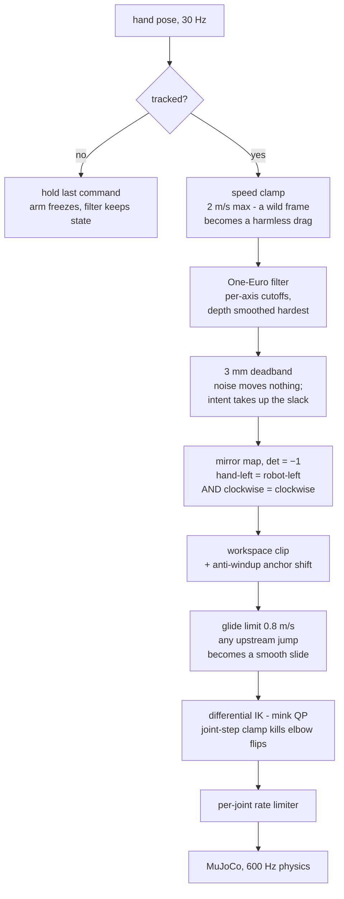

<p align="center">
  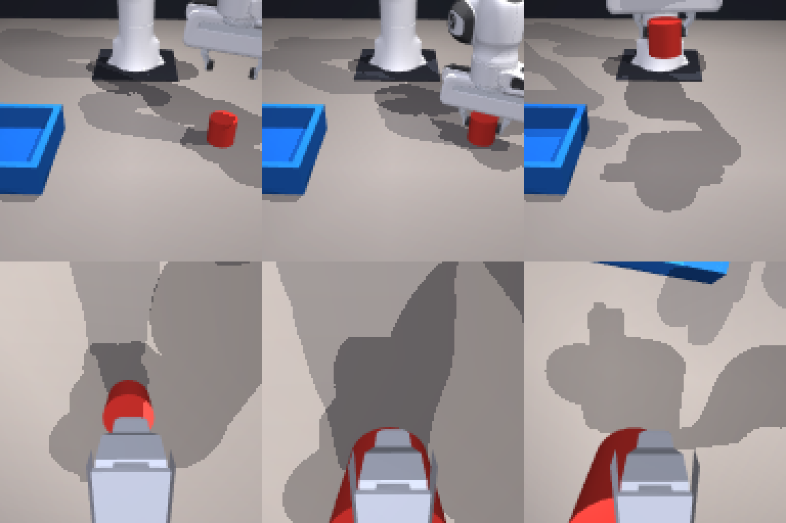
  <br/>
  <em>What the policy actually sees: its 128×128 front (top) and eye-in-hand wrist (bottom) cameras, at three moments of a grasp.</em>
</p>

**`handrobot.sim`** - the action space is six joint position targets in radians,
which is what a real SO-101 accepts over its serial bus. The observation is
joint positions read back plus camera images: what a real rig can measure.
Object poses are used for scripting and scoring, never as a policy input.

**`handrobot.policy`** - ACT, implemented directly. A CVAE encoder absorbs the
variation between demonstrations of the same task; a transformer decoder emits
32 future actions in one shot from image features and joint state. Predicting a
chunk rather than a step is what stops errors compounding. At inference the
overlapping chunks are blended with an exponential weight, which removes the
visible jerk at chunk boundaries.

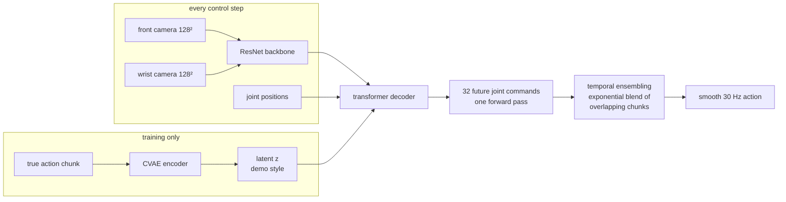

## Tests

```bash
.venv/bin/pytest -q
```

520 tests. The ones that matter most are the ones that would let a silent
physical error through:

- `test_reach.py::test_declared_workspace_is_reachable` - fails if the declared
  workspace is widened past what the arm can actually do.
- `test_gripper.py` - the jaw is a hinge, so the gap is not linear in the joint
  angle; a straight-line model is off by up to 8 mm and this pins the measured
  curve to the model:

  <p align="center">
    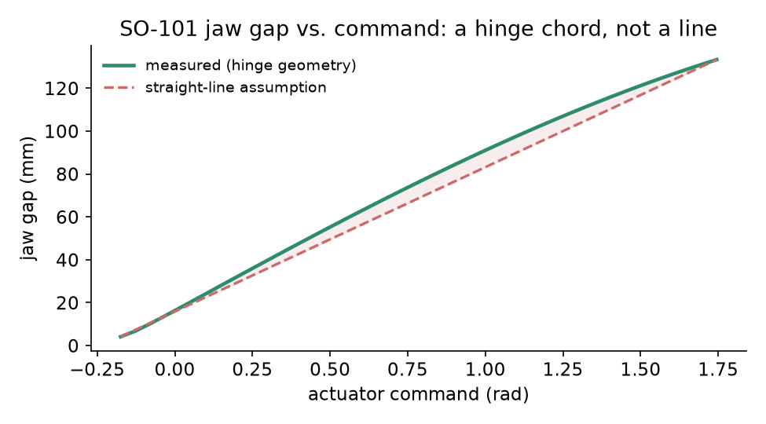
  </p>
- `test_env.py::test_objects_never_spawn_inside_the_arm` - an object placed
  inside the folded arm gets flung across the table on the first step.
- `test_hands.py` - runs against a photograph of a real hand, not mock
  landmarks.
- `test_policy.py::test_policy_can_overfit_a_single_batch` - a model that cannot
  memorise one batch has a wiring bug, not a data problem.
- `test_screen_directions.py` - hand-left is robot-left and clockwise stays
  clockwise, pinned to rendered pixels; the correct camera-to-robot map is a
  mirror, not a rotation, and this is the test that proves it.
- `test_stability.py` - a still hand commands a bit-still arm; releasing the
  clutch, moving 30 cm and re-engaging never steps the command faster than the
  glide limit.
- `test_dexhand.py` - the whole record-train-load loop runs headless against a
  photograph of a real hand, with the webcam stubbed out.

## Where this goes next

The system is a complete, measured pipeline for exactly the thing the field
currently wants: cheap demonstration data. Natural extensions, roughly in order
of value per effort:

- **A real SO-101.** The action and observation spaces already match the
  serial protocol of the physical arm; sim-to-real of this task is a weekend
  of calibration, not a redesign.
- **More tasks on the same recorder** - stacking, insertion, drawer opening -
  and a language-conditioned policy over the multi-task dataset.
- **Depth from stereo or a learned prior**, replacing the single weakest link
  (monocular depth) without adding hardware beyond a second webcam.
- **The dexterous track**: the LEAP retargeter is already trained through
  differentiable FK; closing the loop -- teleoperating the full hand for
  in-hand manipulation data -- is the ambitious version of this repository.

## Limits, stated plainly

- **It is a simulation.** The policy has never touched a real SO-101. The action
  and observation spaces were chosen to match one, which is a precondition for
  transfer, not a demonstration of it.
- **Monocular depth is the weak link.** Absolute distance from one uncalibrated
  camera is approximate, which is why the position mapping consumes hand *motion*
  from a clutch anchor rather than absolute hand position. It is also the only
  axis that depends on the assumed field of view: if forward and back feels far
  more or far less sensitive than left and right, pass `--hfov` (try 68 or 72 on
  a MacBook) to `handcheck` and `teleop`.
- **The workspace ceiling is low** - about 10 cm above the table. That is the
  arm, not the software: above that the SO-101 cannot hold a useful grasp
  orientation.
- **The task is one task.** Cube into bin, randomised placement. Generalising
  across objects would need a different policy class and far more data.

## Licence

MIT (see `LICENSE`). The SO-101 and Franka Panda models under `assets/` and
the LEAP hand model under `assets/leap/` are from
[MuJoCo Menagerie](https://github.com/google-deepmind/mujoco_menagerie) and keep
their own licences, included alongside them.

---

<p align="center">
  <br/>
  <b><i>The hand was the first end effector.</i></b><br/>
  <i>This repository just teaches the second one.</i>
  <br/><br/>
  <sub><a href="https://github.com/guptabhishekumar"><b>Abhishek Kumar Gupta</b></a></sub>
</p>
